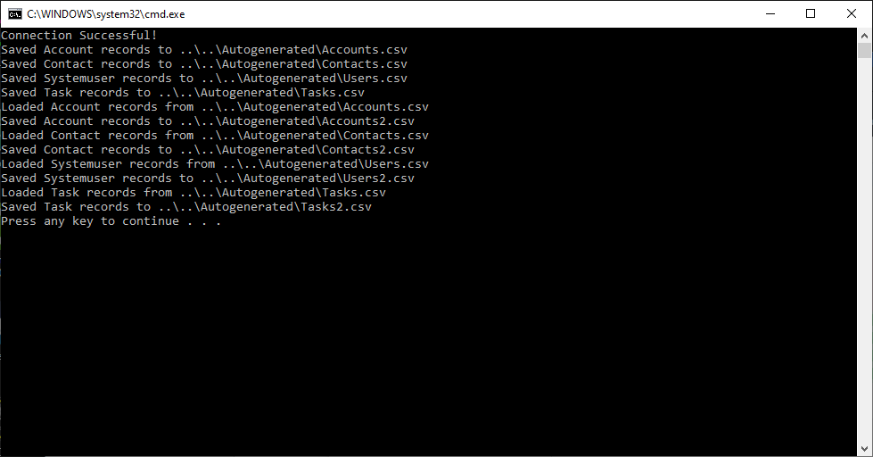
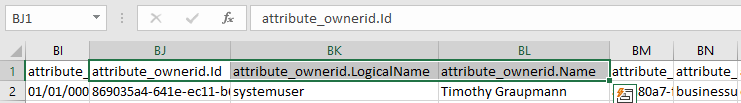
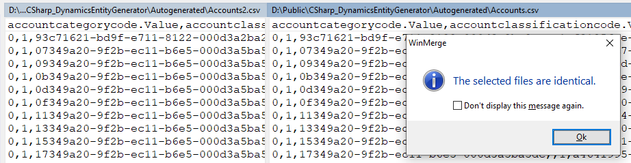

# C# Dynamics 365 Entity Generator

This C# project that queries your Dynamics environment and uses the returned records to autogenerate early bound C# classes that can be easily saved/loaded to/from the CSV UTF8 format.



## Dependencies

* [CsvHelper](https://www.nuget.org/packages/CsvHelper/)

* [Microsoft.CrmSdk.XrmTooling.CoreAssembly](https://www.nuget.org/packages/Microsoft.CrmSdk.XrmTooling.CoreAssembly/)

* Create a Dynamics 365 environment

* Create an Azure Active Directory application -  [Quickstart: Acquire a token and call Microsoft Graph API from a Windows desktop app](https://docs.microsoft.com/en-us/azure/active-directory/develop/quickstart-v2-windows-desktop)

## Quick Start

**Running as an Application User**

* Create a Dynamics application user and give it access to the Azure Active Directory application

* Give the `System Customizer` or `System Administrator` role to the application user to control access to the DataVerse.

Edit `Secrets.cs` to use your own environment and secrets.

```
namespace DynamicsEntityGenerator
{
    class Secrets
    {
        public const string ServiceUrl = "";
        public const string ClientId = "";
        public const string Secret = ""; //secret value
        public const string Tenant = "";
    }
}
```

This mode uses the following `ConnectionString` format.

```
string connectionString =
    string.Format("AuthType=ClientSecret;Url={0};ClientId={1};ClientSecret={2}",
        Secrets.ServiceUrl,
        Secrets.ClientId,
        Secrets.Secret);
```

* Authenticate the service client with OAuth2.

```
IOrganizationService oServiceProxy = null;
try
{

    //Create the Dynamics 365 Connection:
    CrmServiceClient oMSCRMConn =
        new Microsoft.Xrm.Tooling.Connector.CrmServiceClient(connectionString);

    //Create the IOrganizationService:
    oServiceProxy = (IOrganizationService)oMSCRMConn.OrganizationWebProxyClient != null ?
        (IOrganizationService)oMSCRMConn.OrganizationWebProxyClient :
        (IOrganizationService)oMSCRMConn.OrganizationServiceProxy;
}
catch (Exception ex)
{
    Console.Error.WriteLine("Failed to initialize connection! {0}", ex);
}
```

## API

**Use the `OrganizationWebProxyClient` proxy to create a `AutoGeneratorClient` object to auto generate code**

```
AutoGeneratorClient client = new AutoGeneratorClient(oServiceProxy);
```

**Autogenerate C# classes in a datapath from queries given a list of entities**

```
string dataPath = "..\\..\\Autogenerated";

List<AutoGeneratorClient.GenerateEntityItem> entityItems =
    new List<AutoGeneratorClient.GenerateEntityItem>()
{
    new AutoGeneratorClient.GenerateEntityItem("account", "Account"),
    new AutoGeneratorClient.GenerateEntityItem("contact", "Contact"),
    new AutoGeneratorClient.GenerateEntityItem("systemuser", "User"),
    new AutoGeneratorClient.GenerateEntityItem("task", "Task"),
};

client.GenerateClasses(dataPath, entityItems);
```

**Query all entity records and easily save to CSV files**

```
client.QueryDatabaseToCSV<Account>(Path.Combine(dataPath, "Accounts.csv"));
client.QueryDatabaseToCSV<Contact>(Path.Combine(dataPath, "Contacts.csv"));
client.QueryDatabaseToCSV<User>(Path.Combine(dataPath, "Users.csv"));
client.QueryDatabaseToCSV<Task>(Path.Combine(dataPath, "Tasks.csv"));
```



**Query a single record**

```
ColumnSet columnSet = new ColumnSet(true);
Account record = client.Retrieve<Account>(
    Guid.Parse("93c71621-bd9f-e711-8122-000d3a2ba2ea"), columnSet);
```

**Query multiple records**

```
ColumnSet columnSet = new ColumnSet(true);
QueryExpression query = client.NewQueryExpression<Account>();
query.ColumnSet = new ColumnSet(true);
query.TopCount = 100;
List<Account> records = client.RetrieveMultiple<Account>(query);
```

**Load CSV records and resave to compare data integrity**

```
List<Account> accounts = client.LoadCSV<Account>(Path.Combine(dataPath, "Accounts.csv"));
client.SaveCSV(Path.Combine(dataPath, "Accounts2.csv"), accounts);

List<Contact> contacts = client.LoadCSV<Contact>(Path.Combine(dataPath, "Contacts.csv"));
client.SaveCSV(Path.Combine(dataPath, "Contacts2.csv"), contacts);

List<User> users = client.LoadCSV<User>(Path.Combine(dataPath, "Users.csv"));
client.SaveCSV(Path.Combine(dataPath, "Users2.csv"), users);

List<Task> tasks = client.LoadCSV<Task>(Path.Combine(dataPath, "Tasks.csv"));
client.SaveCSV(Path.Combine(dataPath, "Tasks2.csv"), tasks);
```



**Create a record**

```
var account = client.NewRecord<Account>(ownerId);
account.name = string.Format("Test - {0}", Guid.NewGuid());
account.accountid = client.Add(account);
```

**Update a record**

```
var result = client.Retrieve<Account>(account.accountid, columnSet);
result.name = string.Format("{0}*", result.name); //add an asterisk so we can see it change
client.Update(result);
```

**Query with a filter**

```
QueryExpression query = client.NewQueryExpression<Account>();
query.ColumnSet = new ColumnSet(true);
query.TopCount = 10;

FilterExpression filter = query.Criteria;

ConditionExpression condition =
    client.NewConditionExpression<Account>(
        Account.Attribute.name,
        ConditionOperator.Equal,
        "Microsoft");

filter.AddCondition(condition);

List <Account> records = client.RetrieveMultiple<Account>(query);
```

**Delete a record**

```
client.Delete<Account>(account.accountid);
```
