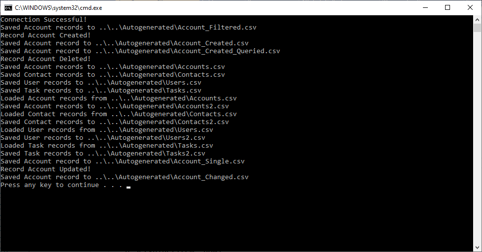
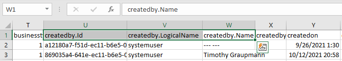

# C# Dynamics 365 Entity Generator

This C# project that queries your Dynamics environment and uses the returned records to autogenerate early binding C# classes that can be easily saved/loaded to/from the CSV UTF8 format.



## Dependencies

* [CsvHelper](https://www.nuget.org/packages/CsvHelper/)

* [Microsoft.CrmSdk.XrmTooling.CoreAssembly](https://www.nuget.org/packages/Microsoft.CrmSdk.XrmTooling.CoreAssembly/)

## Quick Start

* Running as an Application User:

Edit `Secrets.cs` to use your own environment and secrets.

```
namespace DynamicsEntityGenerator
{
    class Secrets
    {
        public const string ServiceUrl = "";
        public const string ClientId = "";
        public const string Secret = ""; //secret value
        public const string Tenant = "";
    }
}
```

This mode uses the following `ConnectionString` format.

```
string connectionString = string.Format("AuthType=ClientSecret;Url={0};ClientId={1};ClientSecret={2}",
                Secrets.ServiceUrl,
                Secrets.ClientId,
                Secrets.Secret);
```

* Authenticate the service client with OAuth2.

```
IOrganizationService oServiceProxy = null;
try
{

    //Create the Dynamics 365 Connection:
    CrmServiceClient oMSCRMConn = new Microsoft.Xrm.Tooling.Connector.CrmServiceClient(connectionString);

    //Create the IOrganizationService:
    oServiceProxy = (IOrganizationService)oMSCRMConn.OrganizationWebProxyClient != null ? (IOrganizationService)oMSCRMConn.OrganizationWebProxyClient : (IOrganizationService)oMSCRMConn.OrganizationServiceProxy;
}
catch (Exception ex)
{
    Console.Error.WriteLine("Failed to initialize connection! {0}", ex);
}
```

## API

* Use the `OrganizationWebProxyClient` proxy to create a `AutoGeneratorClient` object to auto generate code.

```
AutoGeneratorClient client = new AutoGeneratorClient(oServiceProxy);
```

* Autogenerate C# classes in a datapath from queries given a list of entities.

```
string dataPath = "..\\..\\Autogenerated";

List<AutoGeneratorClient.GenerateEntityItem> entityItems = new List<AutoGeneratorClient.GenerateEntityItem>()
{
    new AutoGeneratorClient.GenerateEntityItem("account", "Account"),
    new AutoGeneratorClient.GenerateEntityItem("contact", "Contact"),
    new AutoGeneratorClient.GenerateEntityItem("systemuser", "User"),
    new AutoGeneratorClient.GenerateEntityItem("task", "Task"),
};

client.GenerateClasses(dataPath, entityItems);s);
```

* Query all entity records and easily save to CSV files.

```
client.QueryDatabaseToCSV<Account>(Path.Combine(dataPath, "Accounts.csv"));
client.QueryDatabaseToCSV<Contact>(Path.Combine(dataPath, "Contacts.csv"));
client.QueryDatabaseToCSV<User>(Path.Combine(dataPath, "Users.csv"));
client.QueryDatabaseToCSV<Task>(Path.Combine(dataPath, "Tasks.csv"));
```



* Load CSV records and resave to compare data integrity.

```
List<Account> accounts = client.LoadCSV<Account>(Path.Combine(dataPath, "Accounts.csv"));
client.SaveCSV(Path.Combine(dataPath, "Accounts2.csv"), accounts);

List<Contact> contacts = client.LoadCSV<Contact>(Path.Combine(dataPath, "Contacts.csv"));
client.SaveCSV(Path.Combine(dataPath, "Contacts2.csv"), contacts);

List<User> users = client.LoadCSV<User>(Path.Combine(dataPath, "Users.csv"));
client.SaveCSV(Path.Combine(dataPath, "Users2.csv"), users);

List<Task> tasks = client.LoadCSV<Task>(Path.Combine(dataPath, "Tasks.csv"));
client.SaveCSV(Path.Combine(dataPath, "Tasks2.csv"), tasks);
```


